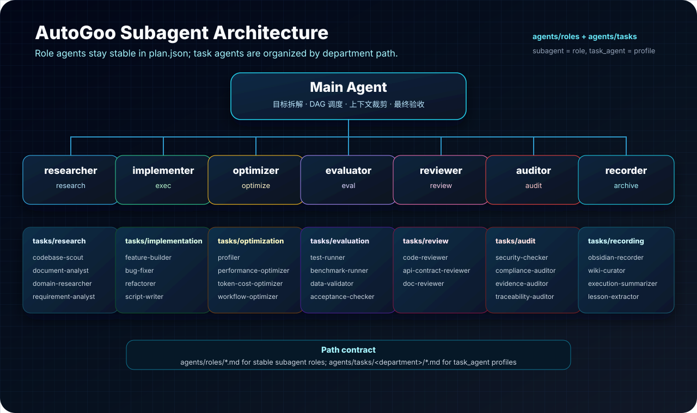

# AutoGoo

[](#版本)
[](LICENSE)
[](#安装)
[](#版本)

AutoGoo 是一个 Claude Code 插件，用于把开放式任务转成可追踪、可恢复、可归档的多 Agent 工作流。它会先从 Goo-wiki 召回已有项目知识，再把任务规划成 DAG，按依赖关系并行执行独立步骤，在需要时加入评测和优化循环，最后把新的经验归档回 Goo-wiki。


## 亮点

- **DAG 优先规划**：执行前先把多步骤任务拆成明确依赖关系。
- **结构化 Markdown 输入**：把 README、TODO、issue 模板和设计文档当作任务载体，而不是默认当作普通文本处理。
- **对话方案沉淀**：把聊天中形成的方案、取舍、约束和验收标准写入 plan 或 Markdown，避免执行阶段依赖上下文记忆。
- **Goo-wiki 经验召回**：规划前读取已有项目页、概念页、周报和历史决策。
- **并行执行**：把无依赖冲突的步骤派发给隔离上下文的 subagent。
- **主 Agent 把关**：主 Agent 负责规划、上下文裁剪、调度、审查、冲突处理和最终验收；subagent 只执行被分配的步骤。
- **优化循环**：识别性能类任务，加入 benchmark、baseline、profiling 和优化对比。
- **持久知识归档**：把任务摘要、步骤证据、指标、决策和经验写回 Goo-wiki。
- **研究资料归档**：通过 `/auto-goo:goo-research paper` 做论文深读、代码/数据集搜索、下载检查和 wiki 归档。
- **日报/周报生成**：扫描 Claude Code 与 Codex 会话，把每日工作沉淀到 Goo-wiki `journal/daily/`。
- **Usage 监控**：参考 Claude-Code-Usage-Monitor 的终端界面风格，扫描本机 Claude Code usage 日志，输出今天总 token、项目分布、模型分布和可选 cost 面板。
- **HTML 工作流发布**：把 `.goo` 中的 brainstorm、plan、DAG、运行状态、产物和活动记录发布为静态 HTML 首页。
- **自改进工作流**：收集执行摩擦点，并通过 `/auto-goo:goo-improve` 进入插件优化流程。
- **命名空间命令**：所有 slash command 使用 `/auto-goo:goo-*`，避免污染命令列表。

## 安装

### Marketplace 安装

从 GitHub 添加 AutoGoo marketplace：

```text
/plugin marketplace add ZixiGu/AutoGoo
```

如果已经添加过 marketplace，可以先更新本地缓存：

```text
/plugin marketplace update
```

然后安装插件：

```text
/plugin install auto-goo@auto-goo
```


### 本地安装

从本地 checkout 添加 marketplace：

```text
/plugin marketplace add /path/AutoGoo
```

安装并启用插件：

```text
/plugin install auto-goo@AutoGoo
/plugin enable auto-goo@AutoGoo
```

## 快速开始

先初始化用户级配置，再按需为具体项目初始化项目级配置：

```text
/auto-goo:goo-init --user
/auto-goo:goo-init --project
```

`goo-init` 由本地交互脚本驱动。它会询问配置作用域和 Goo-wiki 路径，默认提供 `~/workspace/Goo-wiki`；如果用户选择的 Goo-wiki 路径不存在，会自动创建 vault 目录和基础文件，而不是改用 fallback。项目级初始化会创建项目归档根目录，并询问是否把 Goo-wiki 召回、远程服务器使用方式与归档要求写入项目 `CLAUDE.md` 的 AutoGoo marker 块。远程服务器配置只保存非敏感参数到 config，密码存入独立 secrets 文件；slash command 落盘时通过可重复的 `--server 'ip=<host>,user=<user>,port=<port>,type=<cpu|gpu>,purpose=<用途>'` 传入非敏感参数。

只想先审阅 DAG，不立即执行时：

```text
/auto-goo:goo-plan 按地区汇总这份 CSV，并生成一份简短报告
```

从任意 Claude Code 会话启动完整工作流：

```text
/auto-goo:goo-start 按地区汇总这份 CSV，并生成一份简短报告
```

AutoGoo 会：

1. 检测 Goo-wiki vault，并召回相关项目经验。
2. 把请求解析成 `.goo/plan.json` DAG。
3. 使用并行 subagent 执行就绪步骤。
4. 在需要时运行 benchmark 和优化循环。
5. 把日志、决策、指标和经验归档回 wiki 笔记。
6. 收集流程问题，供后续自改进。

## 命令

| 命令 | 用途 |
| --- | --- |
| `/auto-goo:goo-init --user` | 创建用户级默认配置 `~/.auto-goo/config.json`。 |
| `/auto-goo:goo-init --project` | 创建项目级覆盖配置 `.goo/config.json`，并在 Goo-wiki 可用时创建项目归档根目录。 |
| `/auto-goo:goo-brainstorm <方向>` | 目标不明确时，基于 Goo-wiki 生成候选 goals，写入 `.goo/brainstorm.json`，不执行。 |
| `/auto-goo:goo-plan <任务>` | 召回 wiki 上下文并生成 `.goo/plan.json`，不执行。 |
| `/auto-goo:goo-start <任务>` | 启动完整 AutoGoo 工作流。 |
| `/auto-goo:goo-research paper <论文/DOI/arXiv/URL/PDF>` | 论文深读、代码/数据集搜索、下载检查和 Goo-wiki 归档。 |
| `/auto-goo:goo-status` | 渲染当前 `.goo/plan.json` 进度面板。 |
| `/auto-goo:goo-continue` | 通过状态、产物和心跳检查恢复中断任务。 |
| `/auto-goo:goo-daily-report [日期\|范围]` | 扫描 Claude Code 与 Codex 会话，生成 Goo-wiki 日报/周报素材。 |
| `/auto-goo:goo-usage [参数]` | 显示 Claude Code token / usage 监控面板。 |
| `/auto-goo:goo-usage-analyse [项目\|范围]` | 结合 usage 热点和 Goo-wiki 经验，找出项目 token 开销节省方式。 |
| `/auto-goo:goo-publish` | 无需 config，生成 `.goo/site/` 多页站点，发布活动热力图、头脑风暴、计划、任务流程图、DAG、运行状态和产物索引。 |
| `/auto-goo:goo-benchmark` | 执行指标发现、基线测量、profiling、优化和对比。 |
| `/auto-goo:goo-improve` | 回顾近期流程摩擦，生成插件改进建议。 |

自然触发词如 `brainstorm`、`找目标`、`开始任务`、`run:`、`goo-research`、`research`、`读论文`、`论文`、`paper`、`状态`、`继续`、`日报`、`周报`、`评测`、`自改进` 也在 skill prompt 中定义；对外推荐优先使用命名空间 slash command。

## HTML 工作流发布

AutoGoo 的 HTML 发布层用于把整个工作流变成一个可浏览的项目主页：

```text
/auto-goo:goo-publish
```

无需运行 `goo-init` 或创建 `.goo/config.json`，默认输出 `.goo/site/` 多页站点；已有 publish 配置仅作为可选高级覆盖。命令会启动 server 预览 `http://127.0.0.1:9877/` 与 `http://<server-ip>:9877/`；如果端口被占用，会自动尝试后续端口并打印实际地址。server 默认读取已生成的 HTML，打开页面时不重新扫描 `.goo/`；需要每次刷新实时重建时可传 `--live`。页面会读取 `.goo/brainstorm.json`、`.goo/plan.json`、本地 history、logs、artifacts、reports 和 `.goo/obsidian/` fallback，并以 `skills/auto-goo/templates/publish/workflow-shell.html` 为唯一运行时页面外壳、`skills/auto-goo/templates/publish/workflow-theme.css` 为唯一正式视觉主题。关键页面标签默认使用中文：

- 总览：Token 活动热力图、文本型工作流活动、核心指标、最近活动入口和整体状态概述；悬浮格子显示 Token 消耗，点击或聚焦格子会在下方说明所选日期或周期实际完成的工作。
- 运行状态：当前计划的运行状态、完成比例、状态分布和步骤状态列表。
- 计划：当前计划的状态、完成比例、目标、任务流程图和 DAG 分层。
- 头脑风暴：当前 `.goo/brainstorm.json` 或最新历史头脑风暴的候选目标、推荐优先级、原因和预期输出。
- 活动：完整活动记录，包含当前项目 Claude Code usage 日志聚合出的 token 消耗行；列表显示用户任务摘要，点击后展开完整用户任务原文和使用详情。
- 代理执行：从当前计划与步骤日志展示实际代理分配、负责步骤、状态、耗时、产出和执行日志；缺失的旧运行字段明确标记为未记录。
- 产物归档：最近产物索引，便于跳到报告、日志和本地 fallback 笔记。

首页中的指标卡、活动行、头脑风暴目标、代理执行入口和产物行都是可点击入口。默认生成 `index.html`、`plan.html`、`activity.html`、`brainstorm.html`、`status.html`、`agents.html` 和 `artifacts.html`。

发布站点的正式视觉主题位于 `skills/auto-goo/templates/publish/workflow-theme.css`，构建时自动复制到 `.goo/site/workflow-theme.css`。所有页面直接使用该主题，无需发布后手工注入样式。

桌面端固定左侧导航，并将页面标题、生成时间、实时状态和主题按钮固定在顶部；移动端使用自然滚动，避免遮挡正文。

`goo-publish` 是只读展示层：它不修改 `.goo/plan.json`、`.goo/brainstorm.json`、logs 或 Goo-wiki 正文。活动页中的 token 消耗来自 `~/.claude/projects/**/*.jsonl` 里 `cwd` 等于当前项目的 `message.usage`，列表展示聚合 token、模型、记录数和用户任务摘要，点击记录后展开完整用户任务原文和使用详情；不发布 assistant 回复或完整对话正文。HTML 发布也不替代 Goo-wiki 归档；归档仍负责把可复用知识写入 wiki/fallback，HTML 负责把当前项目活动和运行状态集中展示出来。浏览器无法自动弹出时，直接打开脚本输出的本地 URL。

## 研究资料归档

把论文阅读和复现资料检查纳入 AutoGoo 任务链路：

```text
/auto-goo:goo-research paper <论文标题/DOI/arXiv/URL/本地 PDF>
```

`goo-research paper` 会先按 AutoGoo 配置召回 Goo-wiki 项目经验，复用当前 `.goo/plan.json` 或 `.goo/brainstorm.json` 的 `archive.task_archive_root`；没有现成任务归档根时，创建新的 `wiki/projects/<project-slug>/tasks/<task-slug>/execution/`，Goo-wiki 不可写时降级到 `.goo/obsidian/<project-slug>/tasks/<task-slug>/execution/`。

命令会收集公开论文资料、抽取正文和图表线索，主动搜索论文关联代码、项目页、模型、数据集、benchmark 和补充材料，并检查能否下载。大文件默认先做可访问性和元数据验证，不直接下载大量数据；PDF、HTML、代码 checkout、数据集样本等产物放在 `.goo/artifacts/papers/<paper-slug>/` 或用户指定目录，Goo-wiki/fallback 中只保存 `paper-summary.md`、`manifest.json`、`evidence-index.md`、`downloadability.md` 和链接。

## Usage 监控

从 Claude Code 本地日志输出 token / message / model 分布监控面板：

```text
/auto-goo:goo-usage
/auto-goo:goo-usage --watch
/auto-goo:goo-usage --view daily
```

命令默认扫描 `~/.claude/projects/**/*.jsonl` 中的 `message.usage`，统计本机时区今天的整体使用情况，并按项目目录、模型和 token 类型拆分展示。默认输出带 ANSI 颜色；传入 `--no-color` 时禁用。也支持 `daily` 和 `monthly` 聚合视图。cost 不猜测实时价格；需要费用统计时传入 `--price MODEL=INPUT,OUTPUT,CACHE_READ` 或 `--pricing pricing.json`，价格单位为 USD / 1M tokens。

用户侧推荐通过 `/auto-goo:goo-usage` 使用，不需要手动进入插件目录或直接运行内部脚本。

## Usage 降本分析

从 usage 热点和 Goo-wiki 项目经验中找 token 开销节省点：

```text
/auto-goo:goo-usage-analyse
/auto-goo:goo-usage-analyse AutoGoo 最近一周
```

`goo-usage-analyse` 先读取 `goo-usage.py` 的项目、模型、时间和 token 类型分布，再用 `wiki-graph-assist.py` 召回高耗项目相关的项目页、日报/周报、`log.md`、问题页和流程规范。它会把 usage 热点与 wiki 证据对齐，识别反复读大文档、缺少项目入口页、上下文未沉淀、subagent 输入过宽、重复排查、归档缺失、模型选择不匹配或 cache 命中低等成本原因。

默认输出 `.goo/goo-usage-analyse.json`，可附带 `.goo/reports/goo-usage-analyse-<timestamp>.md`。报告只给诊断和候选节省方案，不自动修改业务文件、Goo-wiki 或 `CLAUDE.md`；用户选定方案后再用 `/auto-goo:goo-plan <节省方案>` 转成可执行 DAG。

## 日报/周报

从 Claude Code 和 Codex 会话记录生成 Goo-wiki 日报：

```text
/auto-goo:goo-daily-report
/auto-goo:goo-daily-report 2026-05-20
/auto-goo:goo-daily-report 本周
```

该命令解析 AutoGoo 根目录后调用 `skills/auto-goo/scripts/daily-report-sessions.py`，扫描 `~/.claude/projects/`、`~/.claude/sessions/` 和 `~/.codex/sessions/<YYYY>/<MM>/<DD>/`，按工作流归并会话，写入 `journal/daily/YYYY-MM-DD.md` 并更新 `log.md`。如果同日日报已存在，先读取已有内容，只追加新增会话，避免覆盖已有人工整理。

## 先找目标

当你还不知道要做什么，只想基于 Goo-wiki、项目历史或当前方向找下一步时，使用：

```text
/auto-goo:goo-brainstorm <方向/项目/问题>
```

`goo-brainstorm` 会召回 Goo-wiki 中的项目页、概念页、周报和 `log.md`，提取未完成事项、反复问题、风险、近期计划、指标缺口、文档缺口、测试缺口、发布阻塞和可复用经验。它不会写 `.goo/plan.json`，也不会生成执行 DAG 或启动 subagent；生成后先把候选 goals 写入 `.goo/brainstorm.json` 并展示给用户审阅。用户可能会选择、合并、改写或要求继续 brainstorm，因此不要急着归档；确认最终候选目标后，再归档到 Goo-wiki，Goo-wiki 不可用时写入 `.goo/obsidian/` fallback。

输出写入 `.goo/brainstorm.json`，包含：

- `wiki_context`：召回来源和可复用信号。
- `global_prerequisites`：所有候选目标共同需要先确认的资源、权限、数据、环境、指标或用户取舍。
- `candidate_goals`：3-7 个候选目标，每个包含依据、预期产物、验收标准、风险、前置要求、ready checklist 和第一步。
- `recommended_goal_ids`：推荐优先考虑的目标。
- `decision_needed: true`：等待用户选择、合并、改写或继续 brainstorm。
- `review.status: pending_user_review`：等待用户审阅，不把草案当成最终结果。
- `archive`：本次候选目标归档到 Goo-wiki 或 fallback 的路径与状态；初次生成时保持 `pending_user_review`，确认后写入同一任务归档根的 `brainstorm/` 子目录，后续 plan 写入同一根下的 `plan/` 子目录。如果暂时无法归档，后续 plan 开始执行前必须先补归档。注意这不同于本地 JSON 历史快照：brainstorm 快照放 `.goo/brainstorms/history/`，plan 快照放 `.goo/plans/history/`。

选定一个或多个候选目标后，再进入计划阶段：

```text
/auto-goo:goo-plan 用 cg1 和 cg3 生成计划
```

此时 `goo-plan` 会读取 `.goo/brainstorm.json`，把选中的候选目标转成正式 `goals[]`，并把前置条件和 ready checklist 转成前置检查 step、验收规则或需要用户确认的事项。

## 只规划不执行

当你希望 AutoGoo 先召回上下文、生成执行计划，但暂时不改业务文件、不运行实现命令、不启动 subagent 时，使用：

```text
/auto-goo:goo-plan <任务>
```

该命令会写入可审阅、可恢复的 `.goo/plan.json`，并先让用户看计划摘要、并行组、主要风险和需要确认的点。用户可能会修改 DAG、合并/拆分步骤或调整验收标准，因此计划确认前不要归档 plan 摘要，也不要执行。如果旧 plan 已存在，AutoGoo 会先检查 `steps[]` 是否全部完成：已完成时归档到 `.goo/plans/history/` 后写入新的当前 plan；未完成时先提醒用户当前未完成项，并询问是修改当前 plan，还是新建 plan 并归档旧 plan。用户未明确选择前，不覆盖 `.goo/plan.json`。

如果你还不知道目标，只想基于 Goo-wiki 和项目现状 brainstorm，先使用 `/auto-goo:goo-brainstorm <方向>`。它会写入 `.goo/brainstorm.json`，生成候选 goals、共同前置条件、ready checklist、推荐顺序和风险依据，然后等待你选择；选定一个或多个 goals 后，再用 `/auto-goo:goo-plan <明确目标>` 生成执行 DAG。

`goo-brainstorm` 和 `goo-plan` 的边界很明确：前者发现候选目标，不写 `.goo/plan.json`；后者要求目标已经明确，并写入可执行的 `.goo/plan.json`。

如果 `.goo/brainstorm.json` 已存在，且你说“用 cg1 做 plan”或“把 cg1 和 cg3 合并规划”，`goo-plan` 会读取选中的候选目标，把它们转成正式 `goals[]`，并把候选目标中的前置条件和 ready checklist 转成前置检查 step、验收规则或需要用户确认的事项。

Markdown 文件或片段会被按结构化任务输入解析：标题、checkbox、表格、代码块、路径、命令、约束和验收标准都会转换成规划信号。只有用户明确要求总结、润色或改写 Markdown 时，才按文本处理任务执行。

如果任务在对话中已经讨论出方案，`goo-plan` 还会把已确认方案、拒绝原因、用户偏好、硬约束和验收标准写入 `context_digest`；大段方案材料会优先落到 Goo-wiki 项目路径 `wiki/projects/<project-slug>/context/*.md`，并由 `context_artifacts` 引用。Goo-wiki 不可用时才降级到 `.goo/obsidian/<project-slug>/context/*.md`。后续执行不需要翻聊天记录，只读 plan、相关 Markdown、wiki 摘要和上游产物即可继续。

生成的 plan 应包含：

- `task`：用户原始任务或等价摘要。
- `goals`：交付目标列表。单目标任务也写一个默认 goal；多目标任务按目标分别记录验收标准、最终产物、优先级和依赖关系。
- `wiki_context`：规划前召回的 Goo-wiki 来源和可复用知识。
- `context_digest`：当前对话中已确认的方案、约束、验收标准和未决问题。
- `context_artifacts`：可选，指向 Goo-wiki 项目路径下的 `context/*.md`、fallback `.goo/obsidian/<project-slug>/context/*.md` 或任务 Markdown。
- `review`：计划审阅状态，初次生成后为 `pending_user_review`；用户确认后才进入执行或计划摘要归档。
- `steps`：有序 DAG 节点，包含 `id`、`goal_id` / `goal_ids`、`tier`、`depends_on`、`type`、`status`、`progress`、预期 `output`、`inputs` / `outputs`、读写边界、验收方式和风险确认字段。
- `subagent`：每个步骤的稳定 Role Agent，例如 `researcher`、`implementer`、`optimizer`、`evaluator`、`reviewer`、`auditor`、`recorder`。
- `task_agent`：可选的细分 Task Agent，例如 `code-reviewer`、`document-analyst`、`test-runner`、`data-validator`、`evidence-auditor`、`obsidian-recorder`、`wiki-curator`；用于选择更精确的提示词、工具范围和验收重点，不改变主调度角色。
- `available_skills`：每个步骤允许或建议 Subagent 使用的 skill 名称列表；没有额外 skill 时写空数组，避免把全部 skill 都塞进隔离上下文。
- `max_concurrent`：计划中的并发执行上限。

审阅后可使用 `/auto-goo:goo-start <同一任务>` 执行完整流程，或用 `/auto-goo:goo-continue` 从当前 `.goo/plan.json` 恢复。

一旦 plan 准备开始执行，AutoGoo 会先检查 `.goo/brainstorm.json` 和 `.goo/plan.json` 是否已经由用户确认。若仍是 `pending_user_review`，先停下来让用户审阅和修改，不自动归档、不直接执行。确认后，如果 brainstorm 结果还没有 `archive.status=completed`，会先归档候选 goals、推荐顺序、用户选择/合并依据、前置条件和 wiki 证据，并把归档路径回写到 `.goo/brainstorm.json`，然后才启动业务步骤。brainstorm 与由它生成的 plan 默认共用同一个 Goo-wiki/fallback 任务归档根，例如 `wiki/projects/<project-slug>/tasks/<YYYY-MM-DDTHH-MM-SS-task-slug>/brainstorm/` 和 `.../plan/`；fallback 时使用 `.goo/obsidian/<project-slug>/tasks/<task-slug>/brainstorm/` 与 `.../plan/`。

## Wiki 记忆循环

AutoGoo 把 Goo-wiki 当作项目记忆层，而不只是最终报告目录。每个工作流都有两个 wiki 触点：

1. **规划前召回**：读取与任务相关的项目页、概念笔记、周报和 `log.md`，提取可复用约束、失败经验、已验证命令、数据位置、指标口径和命名规范。
2. **执行后归档**：把最终任务笔记、步骤证据、指标结果、关键决策和后续经验写回 Goo-wiki，同时维护任务页、项目入口、概念页、问题页、周报和 `log.md` 之间的 `[[Wikilink]]`，供未来 AutoGoo 任务复用。

归档时 AutoGoo 不只是创建一个 Markdown 文件。Recorder 需要先检索相关页面，优先复用已有项目/概念/经验页；写入任务页后同步更新项目 `<project-slug>.md` 和 `log.md` 链接，避免产生孤立页面。archive step 的验收必须包含链接关系：任务页链接项目入口、复用知识和关键概念/问题/指标/历史任务页；项目入口和 `log.md` 反向链接任务页；新增经验页链接回任务页或项目入口。这样 Goo-wiki 会形成可通过 Obsidian graph/backlinks 漫游的项目知识图谱。

任何产生可复用内容的命令最终都应归档到 Goo-wiki，不能只保留 `.goo/*.json` 或聊天输出。适用范围包括 `goo-brainstorm` 的候选 goals、`goo-research paper` 的论文资料包和深度笔记、`goo-usage-analyse` 的降本报告、`goo-daily-report` 的日报/周报、`goo-improve` 的改进建议，以及 benchmark/plan/start/continue 的计划、指标、执行证据和经验。纯状态查看、纯初始化配置或用户明确要求不归档时除外；Goo-wiki 不可用时写入 `.goo/obsidian/<project-slug>/` fallback。注意 `goo-brainstorm` 和 `goo-plan` 是 review-first：先让用户审阅和修改，确认后或执行前再归档最终版。

同一条任务链路的 Goo-wiki/fallback 知识归档默认放在同一个任务目录下，用子目录区分阶段：`brainstorm/` 保存候选目标与选择依据，`plan/` 保存正式 DAG、上下文摘要和计划取舍，`execution/` 保存步骤证据、验证结果和最终经验。`.goo/brainstorm.json.archive.task_archive_root` 与 `.goo/plan.json.archive.task_archive_root` 应指向同一个目录，便于从任一阶段追溯完整链路。

本地 JSON 历史快照仍按状态文件类型分开保存，避免破坏现有恢复约定：旧 `.goo/plan.json` 复制到 `.goo/plans/history/plan-<timestamp>.json`；旧 `.goo/brainstorm.json` 复制到 `.goo/brainstorms/history/brainstorm-<timestamp>.json`。这些 history 目录用于审计和回滚参考，不替代 Goo-wiki/fallback 知识归档。

为减少 token 消耗，归档阶段优先生成紧凑 graph packet。它会扫描配置的 wiki 路径，返回少量候选页面、`[[Wikilink]]`、标题和片段；任务页写好后也可以机械更新项目 `<project-slug>.md` 与 `log.md`。

AutoGoo 的 skill 设计遵循渐进披露：`SKILL.md` 只保留触发条件、阶段入口和关键铁律，长规则进入 `references/`，重复机械操作进入 `scripts/`，避免重复机械内容挤占启动上下文。

`goo-init` 会自动创建用户选择的 Goo-wiki 路径，并补齐 `CLAUDE.md`、`log.md`、`wiki/projects/`、`wiki/concepts/`、`wiki/questions/`、`journal/daily/` 和 `journal/weekly/`。运行时只有在 wiki 不可用或不可写时才降级到 `.goo/obsidian/`，并保持本地笔记结构一致。

Wiki 路径解析优先级：

1. `AUTO_GOO_WIKI_DIR`
2. 项目配置 `.goo/config.json` 的 `wiki_dir`
3. 用户配置 `~/.auto-goo/config.json` 的 `wiki_dir`
4. 默认路径 `~/workspace/Goo-wiki`
5. fallback 归档目录 `.goo/obsidian/`

建议先运行 `/auto-goo:goo-init --user` 写入机器级默认值，再在具体 repo 中运行 `/auto-goo:goo-init --project` 写入项目级覆盖。

## 配置

AutoGoo 同时读取用户级和项目级配置。项目配置覆盖用户配置，环境变量 `AUTO_GOO_WIKI_DIR` 会覆盖两者中的 wiki 路径。

用户级配置：

```text
~/.auto-goo/config.json
```

项目级配置：

```text
.goo/config.json
```

示例：

```json
{
  "version": 1,
  "wiki_dir": "~/workspace/Goo-wiki",
  "wiki": {
    "search_paths": [
      "wiki/projects",
      "wiki/concepts",
      "journal/weekly",
      "log.md"
    ]
  },
  "archive": {
    "enabled": true,
    "fallback_dir": ".goo/obsidian",
    "plan_history_dir": ".goo/plans/history",
    "brainstorm_history_dir": ".goo/brainstorms/history",
    "project_slug": "<project-slug>",
    "project_dir": "wiki/projects/<project-slug>",
    "fallback_project_dir": ".goo/obsidian/<project-slug>",
    "git_remote_url": "https://github.com/<owner>/<repo>.git"
  },
  "publish": {
    "enabled": true,
    "site_dir": ".goo/site",
    "index_file": ".goo/site/index.html",
    "host": "0.0.0.0",
    "port": 9877,
    "open_browser": true,
    "include_workflow_activity": true,
    "include_dag": true
  },
  "execution": {
    "max_concurrent": 6,
    "heartbeat_seconds": 30,
    "stale_after_seconds": 120
  },
  "planning": {
    "recall_wiki": true,
    "require_wiki_context": false
  },
  "init": {
    "prompt_for_scope": true,
    "prompt_for_wiki_dir": true
  }
}
```

关键字段：

| 字段 | 含义 |
| --- | --- |
| `wiki_dir` | Goo-wiki vault 根路径。 |
| `wiki.search_paths` | 规划前需要检索的 wiki 区域。 |
| `archive.enabled` | 是否归档任务产物和经验。 |
| `archive.fallback_dir` | Goo-wiki 不可用时的本地 fallback 目录。 |
| `archive.plan_history_dir` | 历史 `.goo/plan.json` 快照目录，默认 `.goo/plans/history`。 |
| `archive.brainstorm_history_dir` | 历史 `.goo/brainstorm.json` 快照目录，默认 `.goo/brainstorms/history`。 |
| `archive.project_slug` | `wiki/projects/` 下的项目文件夹名。 |
| `archive.project_dir` | Goo-wiki 内的项目归档根路径，项目初始化时自动创建。 |
| `archive.fallback_project_dir` | Goo-wiki 不可用时的项目级本地归档根路径。 |
| `archive.git_remote_url` | 项目是 Git repo 时自动记录的 remote 地址；会同步写入 Goo-wiki 项目页。 |
| `publish.enabled` | 是否启用 HTML 工作流发布。 |
| `publish.site_dir` | 静态 HTML 站点输出目录，默认 `.goo/site`。 |
| `publish.index_file` | HTML 首页路径，默认 `.goo/site/index.html`。 |
| `publish.host` | 预览 server 监听地址，默认 `0.0.0.0`，便于远程开发环境访问。 |
| `publish.port` | 预览 server 默认端口，默认 `9877`；占用时自动尝试后续端口。 |
| `publish.open_browser` | 预览 server 启动后是否尝试弹出浏览器。 |
| `execution.max_concurrent` | 最大并行 Agent 槽位数。 |
| `execution.heartbeat_seconds` | Agent 心跳间隔。 |
| `execution.stale_after_seconds` | 恢复时判定 running step 过期的阈值。 |
| `servers[]` | 可选远程服务器列表；每项包含 `ip`、`port`、`user`、`type`、`purpose`、`secrets_file`。 |
| `servers[].secrets_file` | 密码文件路径，项目级默认 `.goo/secrets.json`，用户级默认 `~/.auto-goo/secrets.json`；密码不写入 config、计划、日志或 prompt。 |
| `planning.recall_wiki` | 规划时是否复用 wiki 知识。 |
| `planning.require_wiki_context` | 缺少 wiki 上下文时是否阻塞规划。 |
| `init.prompt_for_scope` | 初始化时是否询问 user/project 作用域。 |
| `init.prompt_for_wiki_dir` | 初始化时是否询问 wiki 路径。 |

## 可选 Session Hooks

如果希望 Claude Code 在会话启动时检查 Goo-wiki 可用性和未完成 AutoGoo plan，可把下面内容加入项目级 `.claude/settings.json`：

```json
{
  "hooks": {
    "SessionStart": [{
      "hooks": [
        {
          "type": "command",
          "command": "ls ~/workspace/Goo-wiki/CLAUDE.md >/dev/null 2>&1 && echo 'Goo-wiki vault ready' || echo 'Goo-wiki not found; using .goo/obsidian fallback'"
        },
        {
          "type": "command",
          "command": "cat .goo/plan.json 2>/dev/null && echo 'Unfinished AutoGoo plan found; run /auto-goo:goo-continue to resume' || true"
        }
      ]
    }]
  }
}
```

## 工作流模型

执行期间，AutoGoo 只把当前 `.goo/plan.json` 当作唯一状态源。历史 plan 会保存在 `.goo/plans/history/`，用于审计和回看；`goo-continue` 默认只从当前 plan 恢复，除非用户明确指定要恢复某个历史文件。

Subagent 默认使用隔离上下文：只拿当前步骤、step 的 `available_skills`、`context_digest` 中相关决策、相关 wiki 约束、直接上游产物、允许读写路径，以及 plan/log/heartbeat 回写要求。它们不会收到完整主会话历史或无关 subagent 推理；需要共享的大段方案必须先整理成 Goo-wiki 项目路径下的 `context/*.md`，再通过路径传递。

### Subagent 组织架构

AutoGoo 的 Subagent 分成两级：**Role Agent** 保持少量稳定，写入 `plan.json` 的 `subagent` 字段并承担状态、心跳、日志和权限边界；**Task Agent** 是 Role Agent 下的细分任务画像，写入 `task_agent` 或步骤说明，用于更精确地控制提示词、工具范围和验收重点。



| Role Agent | 常用 Task Agent | 典型职责 |
| --- | --- | --- |
| `researcher` | `codebase-scout`, `document-analyst`, `domain-researcher`, `requirement-analyst` | 代码/文档/外部资料调研，整理约束和方案。 |
| `implementer` | `feature-builder`, `bug-fixer`, `refactorer`, `script-writer`, `doc-editor` | 在明确范围内实现、修复、整理脚本或编辑文档。 |
| `optimizer` | `profiler`, `performance-optimizer`, `token-cost-optimizer`, `workflow-optimizer` | 建立基线、定位瓶颈、执行有限轮次优化。 |
| `evaluator` | `test-runner`, `benchmark-runner`, `data-validator`, `acceptance-checker` | 运行测试、benchmark、数据质量检查和验收核对。 |
| `reviewer` | `code-reviewer`, `api-contract-reviewer`, `doc-reviewer` | 审查代码、接口/Schema 兼容性和文档可执行性。 |
| `auditor` | `security-checker`, `compliance-auditor`, `evidence-auditor`, `traceability-auditor`, `risk-auditor` | 独立审计安全、合规、证据链、可追溯性和交付风险。 |
| `recorder` | `obsidian-recorder`, `wiki-curator`, `execution-summarizer`, `lesson-extractor` | 整理执行日志，补齐 Goo-wiki/Obsidian 任务页、项目页和经验链接。 |

完整架构、拆分规则和典型流水线见 [`docs/subagent-architecture.md`](docs/subagent-architecture.md)。

| 阶段 | 输出 |
| --- | --- |
| Recall | 相关 Goo-wiki 笔记、历史决策、可复用命令、已知风险和项目约定。 |
| Parse | 任务目标、DAG 步骤、依赖边、优化标记。`/auto-goo:goo-plan` 在此阶段后停止。 |
| Execute | 步骤产物、结构化日志、重试状态、心跳。 |
| Optimize | 指标、基线、profiling 记录、优化实现和对比结果。 |
| Archive | `.goo/logs/` 记录，以及 Goo-wiki 项目/概念笔记。 |
| Improve | 流程摩擦摘要，以及针对插件 prompt、参考文档或设置的改进建议。 |

## 仓库结构

```text
.claude-plugin/             插件元数据
commands/                   /auto-goo:goo-* slash commands
skills/auto-goo/            goo-workflow skill 和参考文档
  SKILL.md                  工作流入口 prompt
  references/               执行、解析、归档、优化等详细说明
  examples/                 工作流示例
  scripts/                  校验、状态、图谱上下文和辅助脚本
  templates/                项目配置模板和 publish HTML 模板
    publish/
      workflow-shell.html   goo-publish 唯一运行时页面外壳
      workflow-theme.css    goo-publish 正式视觉主题
      workflow-*.html       内容与视觉参考页
agents/                     Subagent 定义
  roles/                    稳定 Role Agent，写入 plan.json 的 subagent
  tasks/                    细分 Task Agent，写入 task_agent 或步骤说明
    research/               调研类任务画像
    implementation/         实现类任务画像
    optimization/           优化类任务画像
    evaluation/             评测类任务画像
    review/                 审查类任务画像
    audit/                  审计类任务画像
    recording/              记录归档类任务画像
.goo/                       本地任务计划、日志和归档运行记录
```

## 运行要求

- 支持 plugin 的 Claude Code
- 工具：`Read`、`Write`、`Edit`、`Bash`、`WebSearch`、`Agent`
- 推荐：位于 `~/workspace/Goo-wiki` 的 Goo-wiki Obsidian vault

## 版本

当前版本：**v0.3.3**

这是一个 preview 版本，重点覆盖核心插件契约：

- 命名空间 `/auto-goo:goo-*` 命令
- 通过 `/auto-goo:goo-init` 初始化项目
- plan-only 和 full-run 两种工作流模式
- DAG 规划和执行规范
- 优化与 benchmark 工作流
- Goo-wiki 召回和归档约定
- 插件自改进循环
- 结构自检脚本

## 许可证

AutoGoo 使用 [MIT License](LICENSE) 发布。
