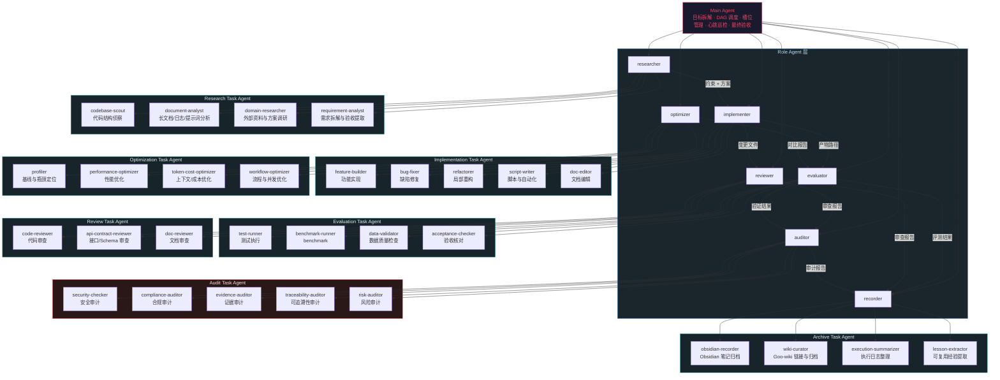

# AutoGoo Subagent 组织架构

AutoGoo 采用两级 agent 组织：

- **Role Agent**：稳定的主角色，出现在 `plan.json` 的 `subagent` 字段中，负责调度边界、权限边界和交付口径。
- **Task Agent**：Role Agent 下的细分任务画像，出现在 `task_agent` 或步骤说明中，用于更精确地选择提示词、工具范围、验收重点和输出格式。

这样可以保持现有执行引擎简单稳定，同时让 Main Agent 在具体任务上分派更专业的执行单元，例如 `reviewer/code-reviewer`、`researcher/document-analyst`、`evaluator/test-runner`、`auditor/evidence-auditor`。

## 路径布局

Agent 文件按角色层级和部门组织，避免所有文件混在 `agents/` 根目录：

```text
agents/
  roles/                  稳定 Role Agent，写入 plan.json 的 subagent
    researcher.md
    implementer.md
    optimizer.md
    evaluator.md
    reviewer.md
    auditor.md
    recorder.md
  tasks/                  细分 Task Agent，写入 task_agent 或步骤说明
    research/
    implementation/
    optimization/
    evaluation/
    review/
    audit/
    recording/
```

新增主角色时放入 `agents/roles/`；新增细分任务时放入对应 `agents/tasks/<department>/`。

## 架构图



## Main Agent 职责

调度逻辑属于 Main Agent，不单独拆分。Main Agent 负责完整生命周期：

1. **目标拆解**：解析用户任务，生成 `plan.json` DAG。
2. **角色选择**：为每个步骤选择稳定的 Role Agent，写入 `subagent`。
3. **任务画像选择**：为步骤补充更细的 Task Agent，写入 `task_agent` 或任务说明。
4. **槽位调度**：扫描就绪步骤，按优先级（扇出度 > 预估耗时 > 同层剩余数）派发。
5. **错峰派发**：`MAX_CONCURRENT` 槽位内，间隔 5-10s 下发 agent。
6. **心跳巡检**：每 30s 检查 running agent，超时 >= `heartbeat_timeout_min`（默认 15min）标记失败。
7. **依赖解锁**：agent 完成后立即回写 `plan.json`，解锁下游步骤。
8. **最终验收**：所有步骤完成后整合结果，触发归档。

## 分层原则

```
Main Agent
  ├─ Role Agent：稳定、少量、可调度
  │   ├─ researcher
  │   ├─ implementer
  │   ├─ optimizer
  │   ├─ evaluator
  │   ├─ reviewer
  │   ├─ auditor
  │   └─ recorder
  └─ Task Agent：通用、细粒度、可扩展
      ├─ code-reviewer
      ├─ document-analyst
      ├─ test-runner
      ├─ data-validator
      └─ ...
```

- `subagent` 只放 Role Agent 名称，保持执行引擎和状态看板稳定。
- `task_agent` 放细分任务画像，作为 prompt、工具、验收重点的选择依据。
- Task Agent 不直接绕过 Role Agent 写计划状态；状态、心跳、日志仍按 Role Agent 的协议执行。
- 新增 Task Agent 优先复用现有 Role Agent 文件，只有当提示词差异稳定且高频时，再拆成独立 `.md` agent 文件。
- 对并发写文件敏感的任务，Main Agent 需要先划定文件范围，避免多个 Task Agent 同时改同一片区域。

## Role Agent 与 Task Agent 映射

| Role Agent | `type` 匹配 | 常用 Task Agent | 典型输入 | 返回物 | 并发安全 |
|------------|-------------|-----------------|----------|--------|----------|
| `researcher` | `research` | `codebase-scout`, `document-analyst`, `domain-researcher`, `requirement-analyst` | 任务描述、路径、文档、错误日志 | 调研报告、约束清单、方案对比 | 只读安全 |
| `implementer` | `exec` | `feature-builder`, `bug-fixer`, `refactorer`, `script-writer`, `doc-editor` | 目标文件、验收标准、上游方案 | 变更文件、执行命令、实现说明 | 需检查写冲突 |
| `optimizer` | `optimize` | `profiler`, `performance-optimizer`, `token-cost-optimizer`, `workflow-optimizer` | 基线、指标、瓶颈线索 | 对比报告、优化补丁 | 需检查写冲突 |
| `evaluator` | `eval` | `test-runner`, `benchmark-runner`, `data-validator`, `acceptance-checker` | 产物路径、测试命令、指标协议 | 测试/评测报告、失败样例 | 默认不改实现 |
| `reviewer` | `review` | `code-reviewer`, `api-contract-reviewer`, `doc-reviewer` | diff、文件路径、规范文档 | 审查报告、问题列表 | 只读安全 |
| `auditor` | `audit` | `security-checker`, `compliance-auditor`, `evidence-auditor`, `traceability-auditor`, `risk-auditor` | plan、日志、diff、验证结果、归档路径 | 审计报告、阻塞风险、证据缺口 | 只读安全 |
| `recorder` | `archive` | `obsidian-recorder`, `wiki-curator`, `execution-summarizer`, `lesson-extractor` | `.goo/logs/`、产物路径、上下文页 | Goo-wiki 笔记、索引链接、经验条目 | 写 wiki，需控范围 |

## 推荐 Task Agent

### researcher 旗下

| Task Agent | 适用场景 | 输出重点 |
|------------|----------|----------|
| `codebase-scout` | 新需求前快速摸清代码结构、入口、已有模式 | 相关文件、调用链、可复用模块、风险点 |
| `document-analyst` | README、长 Markdown、日志、prompt、会议记录、计划文档 | 摘要、结构化要点、待办、冲突与缺口 |
| `domain-researcher` | 需要查外部文档、论文、规范、库用法 | 来源、方案对比、版本/时效性、建议 |
| `requirement-analyst` | 用户输入较长或混合多类约束 | 目标、非目标、验收标准、执行 DAG 候选 |

### implementer 旗下

| Task Agent | 适用场景 | 输出重点 |
|------------|----------|----------|
| `feature-builder` | 增加明确功能 | 变更文件、行为说明、验证命令 |
| `bug-fixer` | 修复可复现错误 | 根因、修复点、回归验证 |
| `refactorer` | 小范围结构整理 | 等价性说明、影响范围、风险 |
| `script-writer` | Bash/Python/CLI 自动化 | 使用方式、参数、错误处理 |
| `doc-editor` | README、CLAUDE.md、规范文档、agent 提示词编辑 | 变更范围、事实依据、过期内容处理 |

### optimizer 旗下

| Task Agent | 适用场景 | 输出重点 |
|------------|----------|----------|
| `profiler` | 优化前建立基线、定位瓶颈 | 基线、测量方法、热点 |
| `performance-optimizer` | 性能、内存、I/O 优化 | 前后指标、修改点、回退条件 |
| `token-cost-optimizer` | 长上下文、文档处理、subagent 成本控制 | 上下文裁剪策略、缓存/摘要边界 |
| `workflow-optimizer` | plan DAG、并发、步骤顺序优化 | 可并发步骤、阻塞点、调度建议 |

### evaluator 旗下

| Task Agent | 适用场景 | 输出重点 |
|------------|----------|----------|
| `test-runner` | 运行单元测试、集成测试、lint | 命令、结果、失败摘要 |
| `benchmark-runner` | benchmark 和回归性能对比 | 协议、原始指标、对比表 |
| `data-validator` | JSONL、数据集、标注、schema 检查 | 统计、异常样例、字段覆盖 |
| `acceptance-checker` | 交付前按用户验收标准逐项核对 | 通过/失败清单、残留风险 |

### reviewer 旗下

| Task Agent | 适用场景 | 输出重点 |
|------------|----------|----------|
| `code-reviewer` | diff 或关键文件审查 | bug、边界条件、测试缺口、行号 |
| `api-contract-reviewer` | CLI/API/schema/配置兼容性 | 破坏性变更、迁移要求、示例一致性 |
| `doc-reviewer` | README、CLAUDE.md、规范文档审查 | 事实错误、缺口、过期命令、可执行性 |

### auditor 旗下

| Task Agent | 适用场景 | 输出重点 |
|------------|----------|----------|
| `security-checker` | 安全敏感改动、依赖、输入输出边界 | 漏洞等级、CWE、修复建议 |
| `compliance-auditor` | 检查是否遵守用户约束、项目规范和命令安全 | 违规项、影响、放行结论 |
| `evidence-auditor` | 交付前检查结论是否有命令、日志、产物或测试证据 | 证据缺口、补证路径 |
| `traceability-auditor` | 检查用户目标、plan、产物、验证和归档是否连得上 | 追溯矩阵、断链项 |
| `risk-auditor` | 高风险变更或交付前独立盘点风险 | 严重程度、缓解措施、回退条件 |

### recorder 旗下

| Task Agent | 适用场景 | 输出重点 |
|------------|----------|----------|
| `obsidian-recorder` | 生成符合 Obsidian/Goo-wiki 规范的 Markdown 笔记 | frontmatter、Wikilink、任务归档页 |
| `wiki-curator` | 归档到 Goo-wiki 并补链接 | 任务页、项目页、log.md、反链关系 |
| `execution-summarizer` | 从 `.goo/logs/` 汇总执行过程 | 时间线、命令、产物、问题 |
| `lesson-extractor` | 沉淀可复用经验 | 经验条目、适用条件、反例 |

## `plan.json` 示例

Task Agent 是可选字段，不改变原有 `subagent` 的主调度语义：

```json
{
  "id": "step-3",
  "type": "review",
  "subagent": "reviewer",
  "task_agent": "code-reviewer",
  "title": "审查实现 diff",
  "depends_on": ["step-2"],
  "available_skills": [],
  "status": "pending"
}
```

适配旧计划时，如果没有 `task_agent`，Main Agent 可根据 `type`、`title`、`files`、`acceptance` 临时推断，但不应回写含糊的任务画像。

## 典型流水线

### 代码功能

```
researcher/codebase-scout
  -> implementer/feature-builder
  -> evaluator/test-runner
  -> reviewer/code-reviewer
  -> auditor/evidence-auditor
  -> recorder/execution-summarizer
```

### 长文档整理

```
researcher/document-analyst
  -> implementer/doc-editor
  -> reviewer/doc-reviewer
  -> recorder/wiki-curator
```

如果文档编辑只是整理和归档，`implementer/doc-editor` 可以省略，由 Main Agent 直接把分析结果转给 `recorder/obsidian-recorder` 或 `recorder/wiki-curator`。

### 数据处理

```
researcher/requirement-analyst
  -> implementer/script-writer
  -> evaluator/data-validator
  -> reviewer/api-contract-reviewer
  -> auditor/traceability-auditor
  -> recorder/lesson-extractor
```

### 优化闭环

```
optimizer/profiler
  -> optimizer/performance-optimizer
  -> evaluator/benchmark-runner
  -> reviewer/code-reviewer
  -> optimizer/workflow-optimizer
```

优化闭环必须有有限轮次、明确指标和停止条件；不能让 review/eval 结果形成无限循环。

## 拆分规则

新增 Task Agent 前先问三个问题：

1. **是否高频**：是否会在多个项目/任务中重复出现。
2. **是否有独立验收口径**：输出格式、风险判断、检查清单是否明显不同。
3. **是否能减少上下文成本**：是否能让 Main Agent 只传局部材料，而不是把全量上下文塞给通用角色。

满足其中两项即可记录为 Task Agent；只有当它需要独立工具权限、独立模型、独立 maxTurns 或独立提示词时，才创建独立 agent 文件。
